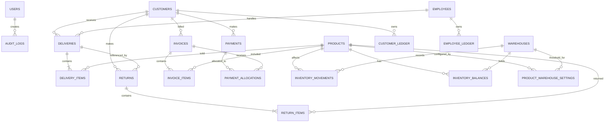

# Entity Relationship Design

## Core Relationships

---

## Inventory Relationships

`INVENTORY_BALANCES` is keyed by `(product_id, warehouse_id)`. A product
has one balance per warehouse, and a warehouse holds one balance per
product.

`PRODUCT_WAREHOUSE_SETTINGS` carries the per-warehouse minimum-stock
threshold and is keyed by the same `(product_id, warehouse_id)` pair. It
is master data and is independent of whether a balance row exists.

---

## Release Status

`WAREHOUSES`, `INVENTORY_MOVEMENTS`, `INVENTORY_BALANCES`, and
`PRODUCT_WAREHOUSE_SETTINGS` are active in the MVP.

Container tracking, and therefore container movement entities, is
deferred.
